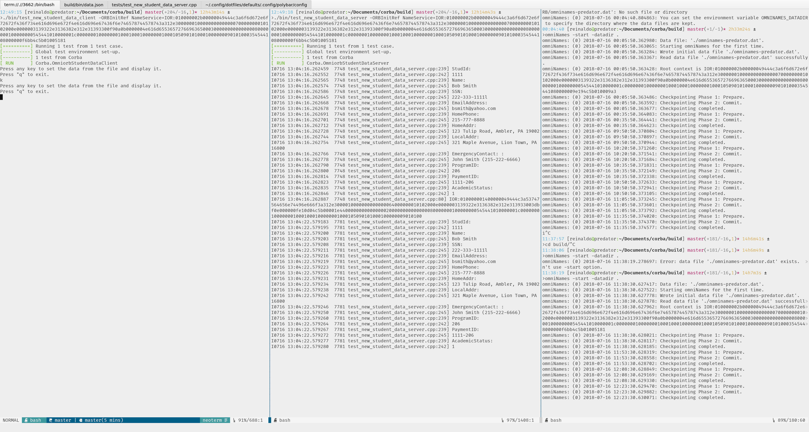
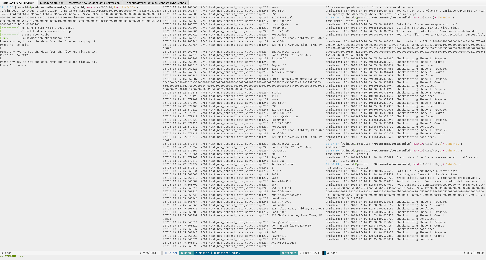

# corba

For learning purposes

## Arch
- Install `omniorb omniorbpy` packages.
- `IDL C++` generation `omniidl -bcxx <filename>.idl`.

## Reference
- [OmniOrb website](http://omniorb.net/docs.html)

## eg3

- Example 3 from the above reference uses **NameService**.
1. Start the service:
	- `omniNames -start -datadir .`
	- It will output to `stdout` an `ORBInitRef`. Look for `IOR:<ior>` with very long
	output.
2. Start the implementation:
	- Copy the previous `<ior>` and substitute below.
	- `eg3_impl -ORBInitRef NameService=IOR:<ior>`
3. Start the client:
	- Copy the previous `<ior>` and substitute below.
	- `eg3_clt -ORBInitRef NameService=IOR:<ior>`

## test_new_student_data

- Example 3 from the above reference uses **NameService**.
1. Start the service:
	- `omniNames -start -datadir .`
	- It will output to `stdout` an `ORBInitRef`. Look for `IOR:<ior>` with very long
	output.
2. Start the implementation:
	- Copy the previous `<ior>` and substitute below.
	- `test_new_student_data_server -ORBInitRef NameService=IOR:<ior>`
3. Start the client:
	- Copy the previous `<ior>` and substitute below.
	- `test_new_student_data_client -ORBInitRef NameService=IOR:<ior>`
4. Copy file `data.json` to `builld/bin`.
5. Launch from build directory.
6. Change the file `data.json` and update the client.
7. Watch the `server` display updated json file objects.

## Shots

